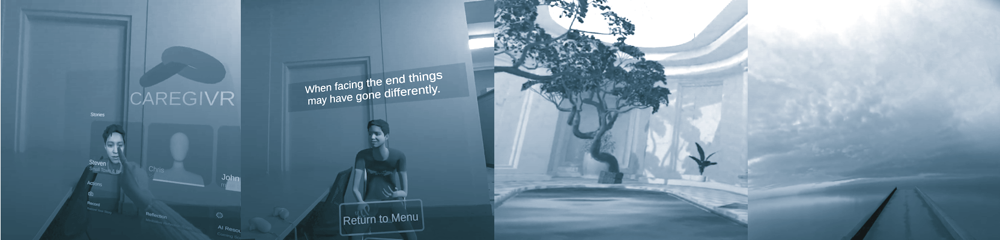

DEVPOST:
https://devpost.com/software/caregivr-tzmqkg

DOWNLOAD APK MIRROR:
https://stevenharmongames.itch.io/caregivr

# Table 8 - Team: Question Mark - CAREGIVR
## Social end of life care VR experience for informed decisions and support

Team members:
Steven Harmon, Jason Webb, Tiago Silva, Peggy Yin, Macarena Peralta

Equiping everyone with the ability to face end of life with dignity and a circle of care and support.
Providing a plaftform for user recorded stories and resources from community and nursing professionals.

DOWNLOAD APK MIRROR: https://stevenharmongames.itch.io/caregivr

Made for MetaQuest3 using body sdk and voice.
https://github.com/oculus-samples/Unity-Movement.git#v71.0.1

Using MIT licensed open source plugins:
https://github.com/roguecode/Unity-Simple-SRT
https://github.com/emilianavt/BVHTools

Used free to use CC assets:
Stone Bridge - xplanepilot
https://sketchfab.com/3d-models/stone-bridge-38879ba7169d4944ac3ef85580f5b1a5
Foldable chair - The Base Mesh
https://www.thebasemesh.com/
Reflection room sounds - x3 sounds:
https://freesound.org/people/Muyo5438/sounds/718704/
https://freesound.org/people/jacekksiazek/sounds/396237/
https://freesound.org/people/jacekksiazek/sounds/396237/
Room prefab - https://sketchfab.com/3d-models/bathhouse-aca612273c874155afddeb15a6574b12
Bonzai Tree - https://sketchfab.com/3d-models/old-tree-5793911821d04f73926ac4ab1d46727a
Plants - https://sketchfab.com/3d-models/plant-in-pot-asset-pack-cda43acf313b4d26a4906fb450d0b2fe
Rugs and pillow pack - https://sketchfab.com/3d-models/ottoman-pillow-and-carpets-v2-58b855b5e2f34e42b9670e252c40c68a

